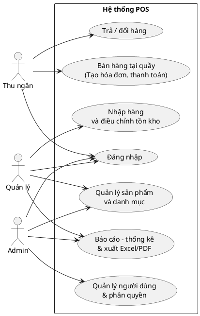
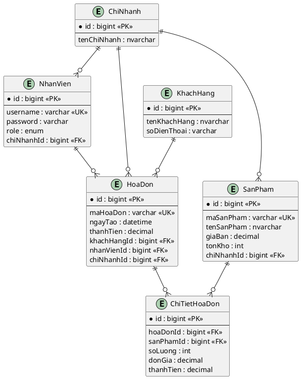
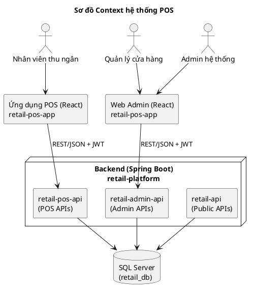
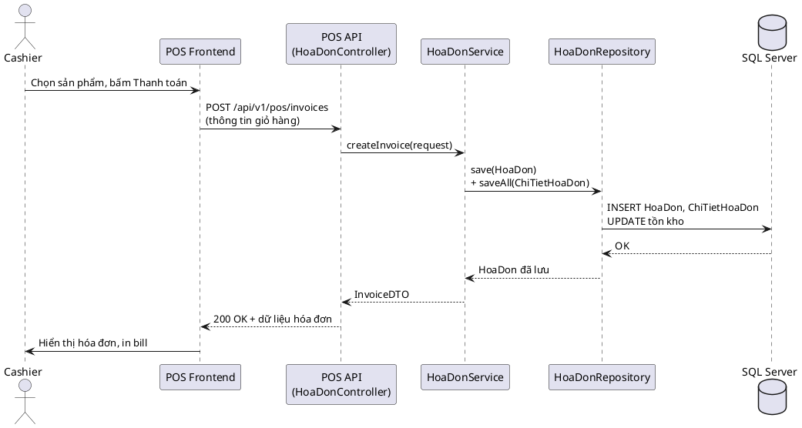
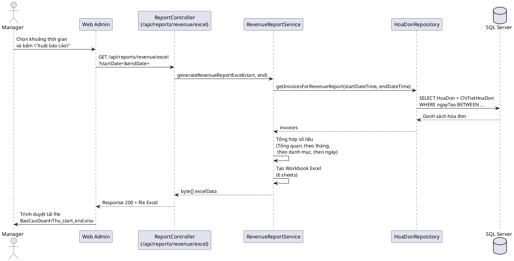

## CHƯƠNG 2. PHÂN TÍCH VÀ THIẾT KẾ HỆ THỐNG

Chương này trình bày quá trình phân tích nghiệp vụ, thiết kế chức năng, mô hình dữ liệu và kiến trúc hệ thống cho bài toán quản lý bán hàng (POS) đã nêu ở Chương 1. Các nội dung được xây dựng bám sát vào hệ thống thực tế đang triển khai trong project backend `retail-platform` và frontend `retail-pos-app`.

---

### 2.1. Phân tích quy trình nghiệp vụ

#### 2.1.1. Quy trình bán hàng tại quầy (POS)

Quy trình bán hàng tại quầy mô tả các bước từ lúc khách hàng mang sản phẩm đến quầy cho đến khi thanh toán hoàn tất và hóa đơn được in ra. Quy trình tổng quát:

1. **Tiếp nhận yêu cầu mua hàng**
   - Khách hàng mang sản phẩm đến quầy thu ngân hoặc cung cấp mã sản phẩm/mã vạch.
   - Thu ngân đăng nhập vào hệ thống POS, mở ca làm việc (nếu có).

2. **Quét/tra cứu sản phẩm**
   - Thu ngân sử dụng **barcode scanner** hoặc chức năng tìm kiếm trên màn hình POS để thêm sản phẩm vào giỏ hàng.
   - Hệ thống kiểm tra trạng thái sản phẩm (đang kinh doanh, còn tồn kho) và tự động hiển thị tên sản phẩm, đơn giá, số lượng, thành tiền.

3. **Áp dụng khuyến mãi/giảm giá (nếu có)**
   - Hệ thống tự động áp dụng khuyến mãi theo cấu hình trong module Khuyến mãi (giảm theo %, giảm theo số tiền, tặng kèm,…).
   - Thu ngân có thể nhập mã giảm giá hoặc điều chỉnh giảm giá thủ công nếu được phân quyền.

4. **Xác nhận giỏ hàng**
   - Thu ngân cùng khách hàng kiểm tra lại danh sách sản phẩm, số lượng, tổng tiền, số tiền giảm giá.
   - Có thể xóa dòng hàng hoặc thay đổi số lượng nếu khách yêu cầu.

5. **Thanh toán**
   - Thu ngân chọn phương thức thanh toán (tiền mặt, chuyển khoản, QR, ví điện tử – trong đề tài giả lập).
   - Hệ thống ghi nhận số tiền khách đưa, tính tiền thừa (nếu có).

6. **In / xuất hóa đơn**
   - Sau khi thanh toán thành công, hệ thống tạo bản ghi **Hóa đơn** và **Chi tiết hóa đơn** trong cơ sở dữ liệu.
   - Hóa đơn được in ra máy in hoặc hiển thị dạng PDF/QR để khách quét.

7. **Cập nhật tồn kho và doanh thu**
   - Tồn kho của từng sản phẩm được trừ tương ứng với số lượng đã bán.
   - Doanh thu/ngày, doanh thu theo ca làm việc được hệ thống cập nhật, phục vụ cho báo cáo ở module Web Admin.

Quy trình trên được triển khai chủ yếu trong module POS của frontend `retail-pos-app` (các page và component POS) và các API tương ứng trong module `retail-pos-api` của backend.

Ví dụ sơ đồ hoạt động (Activity Diagram) cho quy trình bán hàng tại quầy (có thể dùng để vẽ lại bằng PlantUML):

```plantuml
@startuml
start
:Thu ngân đăng nhập POS;
:Mở màn hình bán hàng;

repeat
  :Quét barcode / tìm sản phẩm;
  :Kiểm tra tồn kho;
  if (Đủ tồn kho?) then (Yes)
    :Thêm sản phẩm vào giỏ;
  else (No)
    :Hiển thị cảnh báo\n"Không đủ tồn kho";
  endif
repeat while (Còn sản phẩm?) is (Yes)
end repeat

if (Có khuyến mãi?) then (Yes)
  :Áp dụng khuyến mãi;
endif

:Hiển thị tổng tiền;
:Chọn phương thức thanh toán;
:Gửi yêu cầu tạo hóa đơn\nđến POS API;
:Backend tạo HoaDon + ChiTietHoaDon\nvà cập nhật tồn kho;
:Nhận kết quả, hiển thị hóa đơn;
:In bill / hiển thị QR;
stop
@enduml
```

#### 2.1.2. Quy trình nhập hàng, quản lý tồn kho

Quy trình nhập hàng và quản lý tồn kho nhằm đảm bảo số lượng hàng hóa trong kho luôn phản ánh đúng số liệu thực tế.

1. **Tiếp nhận hàng từ nhà cung cấp**
   - Nhân viên kho hoặc quản lý kiểm tra số lượng và chất lượng hàng giao.
   - Thông tin nhà cung cấp và đơn đặt hàng được đối chiếu (nếu có).

2. **Tạo phiếu nhập hàng**
   - Trên màn hình Web Admin, quản lý tạo **phiếu nhập hàng** mới, chọn chi nhánh, nhà cung cấp, ngày nhập.
   - Thêm các dòng **chi tiết nhập hàng**: sản phẩm, số lượng, giá nhập, ghi chú.

3. **Cập nhật tồn kho**
   - Sau khi phiếu nhập được lưu ở trạng thái hoàn tất, hệ thống:
     - Tăng tồn kho của từng sản phẩm tương ứng với số lượng nhập.
     - Cập nhật giá vốn (nếu có cơ chế tính lại).

4. **Điều chỉnh tồn kho**
   - Trong trường hợp chênh lệch giữa thực tế và sổ sách (hỏng, mất, kiểm kê lại), quản lý có thể tạo phiếu điều chỉnh tồn kho.
   - Hệ thống ghi nhận lý do điều chỉnh, người thực hiện và cập nhật tồn kho tương ứng.

5. **Báo cáo tồn kho**
   - Hệ thống cung cấp các báo cáo tồn kho theo sản phẩm, theo danh mục, theo chi nhánh.
   - Có thể lọc các sản phẩm dưới ngưỡng tồn tối thiểu để đề xuất nhập hàng.

#### 2.1.3. Quy trình quản trị báo cáo – thống kê

1. **Thu thập dữ liệu**
   - Dữ liệu từ các hóa đơn, chi tiết hóa đơn, phiếu nhập hàng, tồn kho, khách hàng,… được lưu trữ trong cơ sở dữ liệu.

2. **Tổng hợp số liệu**
   - Hệ thống backend cung cấp các API báo cáo:
     - Báo cáo doanh thu theo ngày/tháng/khoảng thời gian.
     - Thống kê sản phẩm bán chạy.
     - Báo cáo tồn kho, nhập–xuất–tồn.

3. **Hiển thị trên Dashboard**
   - Web Admin hiển thị các chỉ số chính (doanh thu hôm nay, số đơn, lợi nhuận ước tính, số khách hàng) dưới dạng **stat card**.
   - Các biểu đồ cột, đường (sử dụng thư viện Recharts) thể hiện xu hướng doanh thu và số lượng đơn theo thời gian.

4. **Xuất báo cáo**
   - Người dùng có thể lựa chọn khoảng thời gian và nhấn nút **Xuất Excel/PDF**.
   - Backend sử dụng Apache POI/iText để sinh file báo cáo nhiều sheet (tổng quan, doanh thu theo tháng, sản phẩm bán chạy, thống kê theo ngày,…).

---

### 2.2. Phân tích yêu cầu chức năng qua Use-case

#### 2.2.1. Sơ đồ Use-case tổng quát của hệ thống

Hệ thống có ba tác nhân chính: **Thu ngân**, **Quản lý cửa hàng** và **Quản trị hệ thống (Admin)**. Quan hệ giữa tác nhân và các Use-case chính có thể mô tả bằng sơ đồ Use-case (có thể vẽ lại bằng PlantUML hoặc các công cụ UML khác).

Ví dụ mô tả sơ đồ Use-case tổng quát bằng PlantUML:



#### 2.2.2. Mô tả chi tiết các Use-case chính

##### 2.2.2.1. Use-case Đăng nhập và phân quyền (RBAC)

- **Mục đích**: Xác thực người dùng trước khi truy cập hệ thống, phân quyền theo vai trò (ADMIN, MANAGER, CASHIER).
- **Tác nhân**: Thu ngân, Quản lý, Admin.
- **Tiền điều kiện**: Tài khoản đã được tạo trong hệ thống.
- **Hậu điều kiện**:
  - Người dùng nhận được **JWT token** hợp lệ.
  - Giao diện hiển thị các chức năng tương ứng với vai trò.
- **Luồng chính**:
  1. Người dùng mở trang đăng nhập, nhập username và password.
  2. Frontend gọi API `/api/v1/auth/login` kèm thông tin đăng nhập.
  3. Backend xác thực thông tin, sinh JWT token và trả về thông tin người dùng (id, tên, vai trò, chi nhánh).
  4. Frontend lưu token (trong memory/localStorage) và chuyển hướng đến dashboard hoặc màn hình POS.
- **Luồng ngoại lệ**:
  - Sai mật khẩu hoặc tài khoản bị khóa → hiển thị thông báo lỗi, không cấp token.

##### 2.2.2.2. Use-case Quản lý sản phẩm và danh mục

- **Mục đích**: Cho phép Quản lý/Admin tạo, cập nhật, xóa, tra cứu sản phẩm và danh mục.
- **Tác nhân**: Quản lý, Admin.
- **Luồng chính**:
  1. Người dùng truy cập màn hình quản lý sản phẩm trên Web Admin.
  2. Hệ thống gọi API để tải danh sách sản phẩm theo trang (paging, filtering).
  3. Người dùng có thể:
     - Thêm sản phẩm mới: nhập tên, mã, giá, tồn kho ban đầu, danh mục, chi nhánh.
     - Sửa thông tin sản phẩm: giá, trạng thái, hình ảnh.
     - Vô hiệu hóa sản phẩm khỏi danh sách bán nếu ngừng kinh doanh.
  4. Hệ thống lưu thay đổi vào bảng `SanPham` và các bảng liên quan.

##### 2.2.2.3. Use-case Bán hàng tại quầy (tạo hóa đơn, thanh toán, in bill/QR)

- **Mục đích**: Ghi nhận giao dịch bán hàng, cập nhật tồn kho và doanh thu.
- **Tác nhân**: Thu ngân.
- **Luồng chính**:
  1. Thu ngân đăng nhập và mở màn hình POS.
  2. Thu ngân quét barcode hoặc tìm kiếm sản phẩm, thêm vào giỏ hàng.
  3. Hệ thống hiển thị tạm tính, áp dụng khuyến mãi nếu có.
  4. Thu ngân chọn phương thức thanh toán, xác nhận nhận tiền.
  5. Frontend gửi yêu cầu tạo hóa đơn đến API POS.
  6. Backend tạo bản ghi `HoaDon`, `ChiTietHoaDon`, cập nhật tồn kho.
  7. Hệ thống trả về thông tin hóa đơn; frontend in bill hoặc hiển thị QR.
- **Ngoại lệ**:
  - Tồn kho không đủ → hiển thị thông báo, không cho thanh toán.
  - Lỗi kết nối server → ghi log, thông báo cho người dùng thử lại.

##### 2.2.2.4. Use-case Trả/đổi hàng

- **Mục đích**: Cho phép khách trả hàng hoặc đổi sản phẩm, cập nhật tồn kho và doanh thu.
- **Luồng chính** (mô tả ngắn):
  1. Thu ngân tìm kiếm hóa đơn gốc theo mã hoặc số điện thoại khách hàng.
  2. Chọn các dòng hàng cần trả hoặc đổi, nhập lý do.
  3. Hệ thống tạo hóa đơn trả hàng hoặc phiếu điều chỉnh, cộng lại tồn kho.
  4. Doanh thu được điều chỉnh tương ứng.

##### 2.2.2.5. Use-case Nhập hàng, điều chỉnh tồn kho

- **Tác nhân**: Quản lý.
- **Mục đích**: Ghi nhận các lần nhập hàng và điều chỉnh tồn kho để dữ liệu kho luôn chính xác.
- **Luồng chính**:
  1. Quản lý mở màn hình nhập hàng, tạo phiếu mới.
  2. Chọn nhà cung cấp, ngày nhập, chi nhánh.
  3. Thêm các dòng sản phẩm, số lượng, giá nhập.
  4. Xác nhận phiếu, hệ thống cập nhật tồn kho và lưu lịch sử nhập.

##### 2.2.2.6. Use-case Báo cáo – thống kê doanh thu và hàng bán chạy

- **Tác nhân**: Quản lý, Admin.
- **Mục đích**: Theo dõi hiệu quả kinh doanh và hỗ trợ ra quyết định.
- **Luồng chính**:
  1. Người dùng chọn khoảng thời gian và (nếu cần) chi nhánh cần xem báo cáo.
  2. Hệ thống gọi API báo cáo doanh thu, sản phẩm bán chạy.
  3. Backend tổng hợp dữ liệu từ bảng `HoaDon`, `ChiTietHoaDon`, `SanPham`.
  4. Kết quả được hiển thị dưới dạng bảng và biểu đồ; người dùng có thể xuất Excel/PDF.

---

### 2.3. Phân tích dữ liệu và thiết kế mô hình dữ liệu

#### 2.3.1. Xác định các thực thể dữ liệu

Dựa trên phân tích nghiệp vụ và tài liệu entity trong project (`docs/SYSTEM_ANALYSIS/04_MOI_QUAN_HE_ENTITY.md`), các thực thể chính được xác định bao gồm:

- **ChiNhanh**: thông tin chi nhánh/cửa hàng.
- **NhanVien**: tài khoản nhân viên, dùng cho đăng nhập và phân quyền.
- **KhachHang**: thông tin khách hàng, phục vụ chăm sóc khách hàng và báo cáo.
- **SanPham**: danh sách sản phẩm kinh doanh.
- **HoaDon**: hóa đơn bán hàng.
- **ChiTietHoaDon**: chi tiết từng dòng hàng trong hóa đơn.
- **NhaCungCap**: nhà cung cấp sản phẩm.
- **NhapHang** và **ChiTietNhapHang**: phiếu nhập hàng và các dòng chi tiết.
- **KhuyenMai** và **ChiTietKhuyenMai**: chương trình khuyến mãi và phạm vi áp dụng.
- **NguyenLieu**, **PhieuNhapXuatNguyenLieu**: phục vụ quản lý nguyên liệu (nếu cửa hàng có chế biến).

#### 2.3.2. Mối quan hệ giữa các thực thể (ERD tổng quan)

Mối quan hệ chính giữa các thực thể có thể tóm tắt như sau:

- Một **ChiNhanh** có nhiều `NhanVien`, `SanPham`, `HoaDon`, `NhapHang`, `KhuyenMai`, `NguyenLieu`.
- Một **NhanVien** có thể tạo nhiều `HoaDon`, `NhapHang`, `PhieuNhapXuatNguyenLieu`.
- Một **KhachHang** có thể có nhiều `HoaDon` (quan hệ 1–n).
- Một **HoaDon** có nhiều `ChiTietHoaDon`; mỗi `ChiTietHoaDon` gắn với một `SanPham`.
- Một **NhaCungCap** có nhiều `SanPham` và tham gia vào các `NhapHang`.
- Một **KhuyenMai** có thể áp dụng cho nhiều `SanPham` thông qua `ChiTietKhuyenMai`.

Sơ đồ ER tổng quát (có thể vẽ lại từ tài liệu system analysis) nhấn mạnh trung tâm là các bảng `HoaDon` và `SanPham`, kết nối với `ChiNhanh`, `NhanVien`, `KhachHang` và các bảng liên quan đến nhập hàng/khuyến mãi.

Ví dụ ERD rút gọn bằng PlantUML (dùng khi vẽ lại sơ đồ):



#### 2.3.3. Chuẩn hóa dữ liệu và ràng buộc toàn vẹn

Các thực thể được thiết kế theo các nguyên tắc chuẩn hóa:

- Mỗi bảng có **khóa chính (PK)** duy nhất, thường là cột `id` dạng số nguyên tự tăng hoặc UUID.
+- Các mối quan hệ sử dụng **khóa ngoại (FK)** để đảm bảo toàn vẹn tham chiếu, ví dụ:
  - `HoaDon.khachHangId` → `KhachHang.id`
  - `HoaDon.nhanVienId` → `NhanVien.id`
  - `ChiTietHoaDon.hoaDonId` → `HoaDon.id`
  - `ChiTietHoaDon.sanPhamId` → `SanPham.id`
- Các cột cần đảm bảo duy nhất như `SanPham.maSanPham`, `NhanVien.username`, `SanPham.barcode` được đánh **Unique constraint**.
- Một số cột thường được dùng để lọc/sắp xếp (`ngayTao`, `maHoaDon`, `chiNhanhId`) được đánh **index** để cải thiện hiệu năng truy vấn.

Ngoài ra, các ràng buộc nghiệp vụ như:

- Không cho phép xóa sản phẩm đang được tham chiếu bởi hóa đơn (chỉ cho phép **vô hiệu hóa**).
- Tồn kho không được âm khi thực hiện bán hàng.

được xử lý kết hợp giữa ràng buộc ở database và logic trong Service layer.

---

### 2.4. Kiến trúc hệ thống

#### 2.4.1. Kiến trúc tổng thể: React (FE) – Spring Boot (BE) – SQL Server (DB)

Hệ thống được triển khai theo kiến trúc **client–server**:

- **Frontend**:
  - Ứng dụng React (`retail-pos-app`) chạy trên trình duyệt, đảm nhiệm giao diện POS và Web Admin.
  - Gọi các API REST tới backend thông qua HTTP/HTTPS.

- **Backend**:
  - Hệ thống đa module Spring Boot (`retail-platform`) cung cấp các API cho POS, Admin và public.
  - Xử lý toàn bộ nghiệp vụ, xác thực, phân quyền, báo cáo.

- **Database**:
  - SQL Server lưu trữ dữ liệu tập trung.
  - Kết nối với backend thông qua JDBC/Hibernate.

Có thể mô tả kiến trúc tổng thể theo phong cách C4–Context bằng sơ đồ PlantUML sau:



#### 2.4.2. Kiến trúc các module: POS App, Web Admin, API

Kiến trúc backend được mô tả chi tiết trong tài liệu `01_TONG_QUAN_HE_THONG.md`. Tóm tắt:

- `retail-api`: cung cấp các API public (ví dụ một số báo cáo đơn giản, health check).
- `retail-pos-api`: API chuyên cho POS (bán hàng, hóa đơn, thanh toán).
- `retail-admin-api`: API cho Web Admin (quản lý sản phẩm, nhân viên, báo cáo,…).
- `retail-application`: chứa **business logic** (Service, DTO, Mapper).
- `retail-persistence`: chứa **Repository** (JPA), kết nối với DB.
- `retail-security`: chứa cấu hình bảo mật (JWT, filter, config).
- `retail-domain`: định nghĩa các **Entity** dùng chung.
- `retail-migrations`: chứa các script Flyway để khởi tạo và nâng cấp schema.

Ở phía frontend, `retail-pos-app` được tổ chức thành:

- `pages`: các trang chính (POS, Dashboard, Products, Reports,…).
- `components`: các component dùng chung và theo tính năng (POS, products, customers,…).
- `lib/api`: lớp gọi API, gom các hàm fetch theo module.
- `store`: quản lý state (auth, giỏ hàng) bằng Zustand.

#### 2.4.3. Luồng tương tác và bảo mật: REST API, CORS, JWT, RBAC

Luồng xử lý một request điển hình:

1. Frontend gửi HTTP request kèm header `Authorization: Bearer <JWT>`.
2. Request đi qua `RequestLoggingFilter` để ghi log và gán correlation ID.
3. `JwtAuthFilter` kiểm tra tính hợp lệ của token, tải thông tin người dùng và thiết lập `SecurityContext`.
4. Spring Security kiểm tra quyền truy cập endpoint dựa trên **vai trò** (ADMIN, MANAGER, CASHIER).
5. Controller tiếp nhận request, validate dữ liệu đầu vào bằng Bean Validation.
6. Controller gọi Service, Service gọi Repository để truy xuất dữ liệu.
7. Kết quả được map sang DTO, bọc trong `ApiResponse<T>` và trả về JSON cho frontend.

RBAC (Role-Based Access Control) được áp dụng:

- Thu ngân chỉ được truy cập các API POS (bán hàng, xem thông tin sản phẩm).
- Quản lý được truy cập thêm các API thống kê, quản lý kho, nhập hàng.
- Admin được truy cập các API quản trị người dùng, cấu hình hệ thống.

#### 2.4.4. Mô hình lớp (Controller – Service – Repository – DTO – Entity)

Theo kiến trúc tầng:

- **Controller**:
  - Định nghĩa các endpoint REST cho từng domain (ví dụ: `ReportController`, `ProductController`).
  - Chỉ chứa logic điều phối, không chứa nghiệp vụ phức tạp.

- **Service**:
  - Chứa nghiệp vụ chính, ví dụ: tạo hóa đơn, tính doanh thu, áp dụng khuyến mãi.
  - Sử dụng annotation `@Transactional` để đảm bảo tính toàn vẹn dữ liệu.

- **Repository**:
  - Giao tiếp với DB thông qua JPA/Hibernate, khai báo các query cần thiết.

- **DTO & Mapper**:
  - DTO (Data Transfer Object) được dùng để trao đổi dữ liệu giữa backend và frontend.
  - MapStruct hỗ trợ chuyển đổi giữa Entity và DTO tự động, giảm lỗi mapping thủ công.

#### 2.4.5. Biểu đồ tuần tự (Sequence) cho luồng Tạo hóa đơn / Trả hàng / Báo cáo

Ví dụ sequence đơn giản cho luồng **Tạo hóa đơn**:



Tương tự, có thể xây dựng sequence cho luồng **Trả hàng** và **Sinh báo cáo doanh thu**. Ví dụ sequence sinh báo cáo doanh thu và xuất Excel:



---

### 2.5. Thiết kế cơ sở dữ liệu chi tiết

#### 2.5.1. Mô hình dữ liệu logic (ERD chi tiết)

Dựa trên các thực thể và quan hệ đã liệt kê, ERD chi tiết bao gồm:

- Các bảng chính: `ChiNhanh`, `NhanVien`, `KhachHang`, `SanPham`, `HoaDon`, `ChiTietHoaDon`, `NhaCungCap`, `NhapHang`, `ChiTietNhapHang`, `KhuyenMai`, `ChiTietKhuyenMai`, `NguyenLieu`, `PhieuNhapXuatNguyenLieu`.
- Các mối quan hệ 1–n và n–n được triển khai thông qua các bảng chi tiết (`ChiTietHoaDon`, `ChiTietNhapHang`, `ChiTietKhuyenMai`).

#### 2.5.2. Mô tả từng bảng: cột, kiểu dữ liệu, PK/FK, Unique, Index

Trong báo cáo Word, phần này có thể trình bày dưới dạng bảng. Ví dụ:

- **Bảng `SanPham`**:
  - `id` (PK, bigint, identity)
  - `maSanPham` (varchar, unique)
  - `tenSanPham` (nvarchar)
  - `giaBan` (decimal)
  - `tonKho` (int)
  - `chiNhanhId` (FK → `ChiNhanh.id`)
  - `nhaCungCapId` (FK → `NhaCungCap.id`)

- **Bảng `HoaDon`**:
  - `id` (PK)
  - `maHoaDon` (varchar, unique)
  - `ngayTao` (datetime)
  - `khachHangId` (FK, nullable)
  - `nhanVienId` (FK)
  - `chiNhanhId` (FK)
  - `tongTien`, `giamGia`, `thanhTien` (decimal)
  - `trangThai` (enum: PENDING, COMPLETED, CANCELLED,…)

- **Bảng `ChiTietHoaDon`**:
  - `id` (PK)
  - `hoaDonId` (FK → `HoaDon.id`)
  - `sanPhamId` (FK → `SanPham.id`)
  - `soLuong` (int)
  - `donGia`, `thanhTien` (decimal)

Tương tự, có thể mô tả các bảng `KhachHang`, `NhanVien`, `NhapHang`, `ChiTietNhapHang`, `KhuyenMai`,… mỗi bảng 0.5–1 trang để tăng độ chi tiết.

#### 2.5.3. Thiết kế transaction và xử lý đồng thời

Các nghiệp vụ quan trọng như **bán hàng**, **trả hàng**, **nhập hàng** đều được bao bọc bởi transaction (`@Transactional` ở Service), đảm bảo:

- Nếu xảy ra lỗi trong quá trình tạo hóa đơn (ví dụ lưu chi tiết hóa đơn thất bại), toàn bộ transaction sẽ rollback, không làm sai lệch tồn kho.
- Khi nhiều người dùng thao tác đồng thời, cơ sở dữ liệu đảm bảo khóa mức bản ghi để tránh tình trạng race condition trên tồn kho.

---

### 2.6. Thiết kế giao diện người dùng

#### 2.6.1. Nguyên tắc UX/UI áp dụng

- Giao diện đơn giản, ít bước, ưu tiên **tốc độ thao tác** cho thu ngân.
- Sử dụng màu sắc nhất quán, nhấn mạnh các nút hành động chính (Thanh toán, Lưu, Hủy).
- Thông báo lỗi và cảnh báo được hiển thị rõ ràng, không che mất nội dung quan trọng.

#### 2.6.2. Thiết kế giao diện Retail POS

Các màn hình chính của POS:

- **Màn hình bán hàng**:
  - Khu vực tìm kiếm sản phẩm (bằng tên, mã, barcode).
  - Danh sách giỏ hàng hiển thị các dòng hàng, số lượng, đơn giá, thành tiền.
  - Khu vực tổng tiền, giảm giá, số tiền khách đưa và tiền thừa.
  - Nút hành động: Thanh toán, Hủy giỏ, In hóa đơn.

- **Màn hình lịch sử hóa đơn**:
  - Tra cứu hóa đơn theo mã, ngày, nhân viên.
  - Xem chi tiết, in lại hóa đơn, thực hiện trả hàng.

Hình ảnh các màn hình này sẽ được chụp từ ứng dụng thực tế (`retail-pos-app`) và chèn vào báo cáo ở Chương 3.

#### 2.6.3. Thiết kế giao diện Web Admin

Các nhóm màn hình chính:

- **Dashboard**: hiển thị các chỉ số tổng quan và biểu đồ doanh thu.
- **Quản lý sản phẩm**: danh sách sản phẩm, form thêm/sửa sản phẩm, lọc theo danh mục, trạng thái.
- **Quản lý khách hàng, nhân viên**: danh sách và form chi tiết.
- **Báo cáo – thống kê**: bảng và biểu đồ doanh thu, sản phẩm bán chạy, tồn kho; nút xuất Excel/PDF.

---

### 2.7. Ma trận truy vết yêu cầu

Ma trận truy vết giúp đối chiếu giữa yêu cầu ban đầu và hiện thực trong hệ thống, đảm bảo không bỏ sót chức năng quan trọng.

#### 2.7.1. Bảng ánh xạ Use-case ↔ Bảng dữ liệu

Ví dụ (rút gọn):

| Use-case                      | Bảng dữ liệu liên quan                          |
|------------------------------|-------------------------------------------------|
| Đăng nhập & phân quyền      | `NhanVien`, `ChiNhanh`, bảng phân quyền (enum) |
| Bán hàng tại quầy           | `HoaDon`, `ChiTietHoaDon`, `SanPham`, `KhachHang` |
| Nhập hàng & tồn kho         | `NhapHang`, `ChiTietNhapHang`, `SanPham`, `NhaCungCap` |
| Báo cáo doanh thu           | `HoaDon`, `ChiTietHoaDon`, `SanPham`, `ChiNhanh` |

#### 2.7.2. Bảng ánh xạ Use-case ↔ API Backend

| Use-case                | API chính (ví dụ)                                  |
|-------------------------|----------------------------------------------------|
| Đăng nhập              | `POST /api/v1/auth/login`                          |
| Bán hàng tại quầy      | `POST /api/v1/pos/invoices`, `GET /api/v1/products` |
| Nhập hàng              | `POST /api/v1/admin/imports`, `GET /api/v1/products` |
| Báo cáo doanh thu      | `GET /api/v1/admin/reports/revenue`, `GET /api/reports/revenue/excel` |

#### 2.7.3. Bảng ánh xạ Use-case ↔ Màn hình giao diện (FE)

| Use-case                | Màn hình FE tương ứng                              |
|-------------------------|----------------------------------------------------|
| Đăng nhập              | `LoginPage`                                        |
| Bán hàng tại quầy      | `POSPage` / `PosLayout` trong `retail-pos-app`     |
| Quản lý sản phẩm       | `ProductsPage` (Web Admin)                         |
| Báo cáo – thống kê     | `DashboardPage`, `ReportsPage`                     |

Nhờ các bảng truy vết trên, nhóm thực hiện có thể dễ dàng chứng minh với giảng viên rằng mọi yêu cầu nghiệp vụ quan trọng đều đã được phân tích, thiết kế và hiện thực trong hệ thống.


