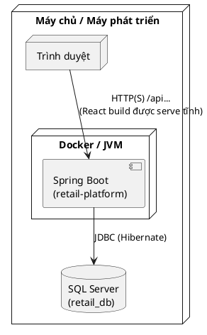

## CHƯƠNG 3. TRIỂN KHAI VÀ THỬ NGHIỆM HỆ THỐNG

Chương này trình bày cách hiện thực hóa hệ thống quản lý bán hàng POS trên nền tảng **Spring Boot (Backend)** và **React (Frontend)**, cấu hình môi trường chạy thử, cũng như các kịch bản kiểm thử và đánh giá kết quả.

---

### 3.1. Triển khai Backend (Spring Boot)

#### 3.1.1. Cấu trúc project và các module

Backend được tổ chức dưới dạng **multi–module Maven** với module gốc `retail-platform` và các module con:

- **`retail-domain`**: định nghĩa các **Entity** (ChiNhanh, NhanVien, SanPham, HoaDon, ChiTietHoaDon, KhachHang, NhapHang, KhuyenMai, …).  
- **`retail-persistence`**: chứa các **Repository** JPA/Hibernate truy cập cơ sở dữ liệu SQL Server.  
- **`retail-common`**: các lớp dùng chung như enum `Status`, `ErrorCode`, `ApiResponse`, exception base,…  
- **`retail-security`**: cấu hình bảo mật Spring Security, `SecurityConfig`, filter `JwtAuthFilter`, class `JwtUtils` sinh/kiểm tra JWT.  
- **`retail-application`**: lớp **Service**, DTO, Mapper (MapStruct) hiện thực nghiệp vụ cho các module: POS, Product, Customer, Invoice, Report,…  
- **`retail-api`**: các API public & tiện ích (PDF hóa đơn, báo cáo Excel,…).  
- **`retail-pos-api`**: API chuyên cho ứng dụng POS (checkout, hóa đơn, sản phẩm, khuyến mãi).  
- **`retail-admin-api`**: API cho Web Admin (quản lý sản phẩm, khách hàng, nhân viên, nhập hàng, báo cáo chi tiết).  
- **`retail-migrations`**: chứa script Flyway để tạo và nâng cấp schema CSDL.  
- **`retail-bootstrap`**: module khởi động ứng dụng Spring Boot, class `RetailPlatformApplication` cấu hình `@SpringBootApplication`, `@EntityScan`, `@EnableJpaRepositories`, `@EnableJpaAuditing`.

Nhờ kiến trúc module hóa, mỗi nhóm chức năng được tách bạch rõ ràng, thuận tiện cho việc phát triển, bảo trì và mở rộng.

#### 3.1.2. Triển khai các chức năng chính

##### 3.1.2.1. Xác thực và phân quyền (Auth, JWT, RBAC)

- Người dùng đăng nhập thông qua API `POST /api/v1/auth/login` (controller `AuthController` trong module `retail-api`).  
- Sau khi xác thực thành công, backend sinh **JWT token** bằng class `JwtUtils`, có chứa username và thời gian hết hạn.  
- Mọi request tới các endpoint cần bảo vệ đều đi qua:
  - **Filter `JwtAuthFilter`**: trích token từ header `Authorization: Bearer ...`, xác thực token, tải `UserDetails` và gán vào `SecurityContext`.  
  - **`SecurityConfig`**: khai báo các đường dẫn public (`/api/v1/auth/**`, `/api/reports/**`, `/swagger-ui/**`, ...) và các đường dẫn yêu cầu role:
    - `/api/v1/pos/**` → role `CASHIER`, `MANAGER`, `ADMIN`.
    - `/api/v1/admin/**` → role `MANAGER`, `ADMIN`.
- Mật khẩu người dùng được mã hóa bằng **BCrypt** (`PasswordEncoder`), không lưu plaintext trong CSDL.

Nhờ cơ chế này, các API POS và Admin được bảo vệ an toàn, chỉ người dùng có quyền mới truy cập được.

##### 3.1.2.2. Module quản lý sản phẩm, danh mục và kho

- Các API quản lý sản phẩm được triển khai trong module `retail-admin-api`, ví dụ:
  - `POST /api/v1/admin/products` – tạo sản phẩm mới.  
  - `PUT /api/v1/admin/products/{id}` – cập nhật sản phẩm.  
  - `GET /api/v1/admin/products/search` – tìm kiếm sản phẩm theo từ khóa.  
  - `GET /api/v1/admin/products/low-stock` – danh sách sản phẩm tồn kho thấp.
- Lớp `ProductService` trong `retail-application` đảm nhận:
  - Kiểm tra trùng `maSanPham`, `barcode`.  
  - Map DTO ↔ Entity bằng `ProductMapper`.  
  - Sử dụng annotation `@Cacheable`, `@CacheEvict` để cache danh sách sản phẩm, tăng hiệu năng cho POS.  
- Số lượng tồn kho được cập nhật khi:
  - Nhập hàng (tăng tồn) thông qua các service nhập hàng.  
  - Bán hàng (giảm tồn) hoặc trả hàng (tăng lại tồn) trong module POS.

##### 3.1.2.3. Module POS – Bán hàng, hóa đơn, treo bill

Các API POS chính nằm trong module `retail-pos-api`:

- `POST /api/v1/pos/checkout` – thanh toán, tạo hóa đơn hoàn tất.  
- `POST /api/v1/pos/hold-bill` – **treo bill**: lưu hóa đơn ở trạng thái PENDING chưa trừ tồn kho.  
- `GET /api/v1/pos/invoices` – truy vấn hóa đơn theo ngày, khoảng ngày, khách hàng,…  
- `GET /api/v1/pos/products/search` – tìm sản phẩm cho POS.

Nghiệp vụ được hiện thực trong `PosServiceImpl`:

- **validateCart(...)**: kiểm tra từng dòng giỏ hàng (sản phẩm tồn tại, đang ACTIVE, tồn kho đủ, số lượng hợp lệ).  
- **checkout(...)**:
  - Tạo entity `HoaDon` với status `COMPLETED`, generate mã hóa đơn `HD-YYYYMMDDHHmmss`.  
  - Tạo danh sách `ChiTietHoaDon`, trừ tồn kho sản phẩm tương ứng.  
  - Tính tổng tiền, giảm giá, điểm tích lũy, cập nhật điểm khách hàng (nếu có).  
  - Bọc toàn bộ xử lý trong `@Transactional` để đảm bảo nếu lỗi ở bất kỳ bước nào thì rollback.  
- **holdBill(...)**:
  - Tạo `HoaDon` ở trạng thái `PENDING`, không trừ tồn kho và không tích điểm.  
  - Cho phép thu ngân “treo” đơn hàng để xử lý sau.
- Các phương thức truy vấn hóa đơn (`getInvoicesByDate`, `getInvoicesByDateRange`, …) sử dụng **cache `invoices`** để giảm tải truy vấn CSDL.

##### 3.1.2.4. Module báo cáo, thống kê và xuất Excel/PDF

Chức năng báo cáo được chia thành:

- **API báo cáo doanh thu dạng JSON** (`/api/v1/admin/reports/revenue`) – dùng cho dashboard, biểu đồ trên Web Admin.  
- **API xuất Excel doanh thu** (`/api/reports/revenue/excel`) – controller `ReportController` trong module `retail-api`.  
- **Service `ReportServiceImpl` và `RevenueReportService`**:
  - Truy vấn dữ liệu hóa đơn qua `HoaDonRepository`.  
  - Tổng hợp số liệu: tổng doanh thu, lợi nhuận ước tính, doanh thu theo tháng, doanh thu theo danh mục, sản phẩm bán chạy, thống kê theo ngày.  
  - Tạo file Excel với nhiều sheet (Tổng quan, Doanh thu theo tháng, Doanh số theo danh mục, Sản phẩm bán chạy, Chi tiết đơn hàng, Thống kê theo ngày).  
  - Sử dụng Apache POI để định dạng tiền tệ, số, căn chỉnh cột, style header.
- Xuất PDF hóa đơn được triển khai bằng iText 7 trong một service riêng (dùng cho chức năng in hóa đơn PDF nếu cần).

#### 3.1.3. Các kỹ thuật xử lý quan trọng

- **Transaction Management**:
  - Các nghiệp vụ quan trọng (checkout, nhập hàng, hủy hóa đơn, treo bill) được đánh `@Transactional` để đảm bảo tính toàn vẹn dữ liệu.
  - Nếu xảy ra exception ở giữa quy trình (ví dụ lưu chi tiết hóa đơn thất bại), toàn bộ thay đổi sẽ được rollback.

- **Validation & Exception Handling**:
  - Dữ liệu đầu vào được kiểm tra bằng **Bean Validation** (`@Valid`, `@NotNull`, `@Positive`, …).  
  - Các lỗi nghiệp vụ được ném dưới dạng `BusinessException` với `ErrorCode` cụ thể; controller trả về `ApiResponse` chuẩn hóa cho FE dễ xử lý.

- **Caching & Performance**:
  - Dùng cache cho danh sách sản phẩm (`products`) và hóa đơn (`invoices`) để giảm tần suất truy vấn CSDL cho các màn hình hay xem lặp lại (POS, danh sách hóa đơn, báo cáo).  
  - Cache được clear (`@CacheEvict`) khi có thay đổi dữ liệu (tạo hóa đơn mới, cập nhật sản phẩm,…).

- **Logging & Monitoring**:
  - `RequestLoggingFilter` ghi log toàn bộ request/response, gắn `correlationId` vào MDC, giúp dễ truy vết lỗi.  
  - Log được ghi theo định dạng JSON (Logback + Logstash encoder), sẵn sàng tích hợp với ELK Stack nếu triển khai thật.

---

### 3.2. Triển khai Frontend (React)

#### 3.2.1. Cấu trúc thư mục, routing và layout

Frontend nằm trong thư mục `retail-pos-app`, được xây dựng bằng **React + TypeScript + Vite**. Cấu trúc chính:

- `src/pages`: các trang chức năng (auth, dashboard, pos, products, customers, invoices, inventory, promotions, reports, settings, …).  
- `src/components`: component dùng chung (`common`, `ui`) và component theo tính năng (`features/pos`, `features/products`, …).  
- `src/lib/api`: lớp gọi API (axios clients, hàm authAPI, posAPI, productAPI,…).  
- `src/store`: state global sử dụng **Zustand** (`authStore`, `cartStore`).  
- `src/routes/index.tsx`: cấu hình **React Router**, layout và route được bảo vệ.

Routing:

- `/login` – trang đăng nhập (public).  
- `/pos` – layout POS, chứa:
  - `/pos` – chọn bàn (table selection).  
  - `/pos/table/:tableId` – màn hình bán hàng cho từng bàn (`POSPage`).  
  - `/pos/payment` – màn hình thanh toán.  
- `/` – layout Dashboard, chứa:
  - `/dashboard`, `/products`, `/customers`, `/invoices`, `/inventory`, `/promotions`, `/settings`, `/reports`, …

Component `ProtectedRoute` sử dụng `useAuthStore` để:

- Hiển thị màn hình loading khi đang `initialize` auth từ localStorage.  
- Chuyển hướng sang `/login` nếu người dùng chưa đăng nhập.

#### 3.2.2. Triển khai giao diện và logic POS bán hàng tại quầy

Các thành phần chính của module POS:

- **`POSLayout`**: layout hai cột, bên trái là danh sách bàn hoặc danh sách sản phẩm, bên phải là panel giỏ hàng/đơn hiện tại.  
- **`TableSelectionPage`**: cho phép chọn bàn trước khi vào màn hình bán hàng; khi chọn bàn, trạng thái được lưu vào `cartStore`.  
- **`POSPage`**:
  - Gọi `posAPI.getProducts()` để tải danh sách sản phẩm hiển thị dạng lưới.  
  - Hỗ trợ lọc theo danh mục (“Đồ ăn”, “Đồ uống”), tìm kiếm theo tên/mã sản phẩm.  
  - Khi click vào `ProductCard`, sản phẩm được thêm vào giỏ hàng thông qua `useCartStore`.  
  - Panel bên phải (`OrderSummary`) hiển thị danh sách dòng hàng, số lượng, thành tiền, áp dụng giảm giá, tổng tiền.
- **`PaymentPage`**:
  - Thu thập thông tin thanh toán (phương thức thanh toán, khách hàng, ghi chú).  
  - Gọi API POS checkout để tạo hóa đơn; khi thành công, hiển thị thông báo và có thể chuyển về màn hình chọn bàn.

Trạng thái giỏ hàng (`cartStore`) chứa:

- Danh sách item (id sản phẩm, tên, đơn giá, số lượng).  
- Bàn hiện tại (`selectedTable`).  
- Các thao tác thêm/xóa/sửa số lượng, reset giỏ hàng sau khi thanh toán.

#### 3.2.3. Triển khai giao diện Web Admin (dashboard, CRUD, báo cáo)

Trên layout `DashboardLayout`, các trang chính bao gồm:

- **`DashboardPage`**:
  - Hiển thị các **stat card**: doanh thu hôm nay, số đơn, lợi nhuận ước tính, số khách hàng.  
  - Biểu đồ đường/cột thể hiện xu hướng doanh thu và số đơn trong vài ngày gần nhất.  
  - Danh sách sản phẩm bán chạy trong ngày/khoảng thời gian.

- **`ProductsPage`**:
  - Bảng danh sách sản phẩm có phân trang, lọc theo từ khóa/danh mục.  
  - Nút thêm mới, sửa sản phẩm; form sử dụng `react-hook-form` + `zod` để validate.  

- **`CustomersPage`, `EmployeesPage`, `InvoicesPage`, `InventoryPage`, `PromotionsPage`**:
  - Mô hình tương tự: bảng danh sách, xem chi tiết, một số chức năng CRUD cơ bản (tùy phạm vi thực tập).

- **`ReportsPage` / phần Báo cáo trong Dashboard**:
  - Giao diện chọn khoảng thời gian (date range picker).  
  - Bảng/biểu đồ doanh thu và nút **“Xuất báo cáo doanh thu”**, thực hiện gọi API `/api/reports/revenue/excel`.

Bạn có thể chụp màn hình các trang tiêu biểu (Dashboard, POSPage, ProductsPage, Reports) và chèn vào báo cáo tại các mục 3.2.2–3.2.3 để minh họa.

#### 3.2.4. Quản lý state, gọi API, xử lý lỗi, bảo vệ route

- **State & Auth (`authStore`)**:
  - Lưu thông tin người dùng đăng nhập (`LoginResponse`) và token.  
  - Lưu token và user vào `localStorage` để duy trì phiên đăng nhập sau khi reload trang.  
  - Hàm `initialize()` đọc lại token từ localStorage, kiểm tra hết hạn bằng hàm `isJWTExpired` rồi khởi tạo state.  

- **Gọi API (`lib/api`)**:
  - `client.ts` cấu hình hai instance axios: `apiClient` (base `/api/v1`) và `publicApiClient` (base `/api`).  
  - Interceptor request tự động gắn header `Authorization: Bearer <token>` nếu token còn hạn.  
  - Interceptor response xử lý lỗi 401: xóa token, xóa user và tự động chuyển hướng về `/login`.

- **Validation & thông báo lỗi trên FE**:
  - Các form sử dụng `react-hook-form` kết hợp `zod` để validate dữ liệu trước khi gửi lên backend.  
  - Thư viện `sonner` hiển thị toast thành công/thất bại, giúp người dùng dễ nhận biết kết quả thao tác.

- **Bảo vệ route**:
  - `ProtectedRoute` kiểm tra `isAuthenticated` và `isInitialized` từ `authStore` trước khi render các layout chính.  
  - Nếu chưa đăng nhập, người dùng bị chuyển sang trang `/login`.

---

### 3.3. Công nghệ & môi trường triển khai

#### 3.3.1. Ngôn ngữ, framework, thư viện sử dụng

- **Backend**:
  - Java 21, Spring Boot 3.2.0, Spring Data JPA, Spring Security, Hibernate, Flyway.  
  - Apache POI (Excel), iText 7 (PDF), Redis (cache), MapStruct, Lombok, Logback + Logstash encoder, Testcontainers, JUnit 5, Mockito.

- **Frontend**:
  - React 19, TypeScript, Vite, React Router, React Query, Zustand, Tailwind CSS, Radix UI, Recharts, axios.  

- **Database & công cụ**:
  - Microsoft SQL Server 2019+, SQL Server Management Studio.  
  - Postman/Swagger UI để test API.

#### 3.3.2. Môi trường phát triển và triển khai

- **Môi trường phát triển (local)**:
  - Backend chạy trên `http://localhost:8081`.  
  - Frontend chạy trên `http://localhost:5173`.  
  - CSDL SQL Server cài trên máy local (hoặc container Docker) với database `retail_db`.  
  - File cấu hình `application.properties` thiết lập chuỗi kết nối, account DB, cấu hình JWT, Redis, Flyway.

- **Triển khai thử nghiệm**:
  - Có thể dùng `docker-compose` (file `docker-compose.yml` trong project) để spin up SQL Server, Redis và ứng dụng Spring Boot.  
  - Frontend build ra static files (`npm run build`) rồi serve bằng web server (Nginx, Apache) hoặc dev server Vite preview.

Sơ đồ triển khai đơn giản:

---

### 3.4. Đánh giá sau triển khai

Mục này tập trung đánh giá hệ thống sau khi đã triển khai các thành phần backend và frontend, dựa trên quan sát thực tế khi chạy demo và các kết quả kiểm thử được trình bày chi tiết ở Chương 4.

#### 3.4.1. Độ ổn định và hiệu năng vận hành

- Trong môi trường phát triển local, hệ thống POS có thể phục vụ đồng thời nhiều thao tác bán hàng, nhập hàng và xem báo cáo mà không xuất hiện hiện tượng treo ứng dụng hoặc lỗi nghiêm trọng.  
- Các thao tác thường xuyên tại quầy (tìm kiếm sản phẩm, thêm vào giỏ, thanh toán) cho thời gian phản hồi ở mức chấp nhận được đối với bài toán thực tập.  
- Cơ chế cache cho danh sách sản phẩm và hóa đơn giúp giảm thời gian tải dữ liệu cho các màn hình lặp lại như POS, danh sách hóa đơn, báo cáo.

#### 3.4.2. Tính thân thiện của giao diện người dùng

- Giao diện **POS** được thiết kế theo bố cục hai cột, giúp thu ngân dễ quan sát cả danh sách sản phẩm và giỏ hàng trên cùng một màn hình. Việc lựa chọn bàn, thêm sản phẩm và thanh toán được gom vào ít bước, phù hợp với thao tác thực tế.  
- Giao diện **Web Admin** sử dụng layout dashboard quen thuộc, với menu bên trái và nội dung chính bên phải, giúp quản lý dễ dàng truy cập các chức năng: sản phẩm, khách hàng, hóa đơn, báo cáo.  
- Các thông báo thành công/thất bại, loading state và validation trên form được hiển thị rõ ràng, góp phần nâng cao trải nghiệm người dùng.

#### 3.4.3. Khả năng mở rộng và bảo trì

- Nhờ kiến trúc multi–module (tách `retail-pos-api`, `retail-admin-api`, `retail-application`, `retail-persistence`, `retail-security`), việc bổ sung chức năng mới hoặc chỉnh sửa logic có thể thực hiện cục bộ từng module, hạn chế ảnh hưởng chéo.  
- Ở phía frontend, cấu trúc tách `pages`, `components`, `lib/api`, `store` giúp dễ dàng thêm trang mới (ví dụ: báo cáo chi nhánh, quản lý khuyến mãi nâng cao) mà không làm rối code hiện có.  
- Việc sử dụng các thư viện chuẩn (Spring Boot, React, React Query, Zustand, Tailwind) tạo nền tảng tốt cho việc bảo trì và nâng cấp trong tương lai.

#### 3.4.4. Liên hệ với kế hoạch kiểm thử

Các hoạt động kiểm thử cụ thể (phạm vi, kỹ thuật, test case chi tiết và kết quả) được trình bày đầy đủ trong **Chương 4 – Kế hoạch kiểm thử và báo cáo kết quả**. Chương 3 chỉ tổng kết ở góc độ triển khai hệ thống và quan sát vận hành, nhằm tránh trùng lặp nội dung và giúp báo cáo có cấu trúc rõ ràng:  
- Chương 3: nhấn mạnh **cách xây dựng hệ thống và đánh giá tổng quan sau triển khai**.  
- Chương 4: tập trung vào **phương pháp kiểm thử, test case và số liệu đánh giá chất lượng**.

